<div align="center">

# Sortify

**放手时刻：智能体自主驱动的影响力置换排序优化**

<br>

<table width="100%">
<tr>
<td align="center" colspan="4">
<h3><a href="https://arxiv.org/abs/2603.27765">Technical Report</a></h3>
</td>
</tr>
<tr>
<td align="center" width="33%"><a href="docs/dives/zh/"><strong>架构解析</strong></a></td>
<td align="center" width="33%"><a href="docs/sortify-demo.mp4"><strong>演示视频</strong></a></td>
<td align="center" width="33%"><a href="README.md"><strong>English</strong></a></td>
</tr>
</table>

</div>

---

> [!IMPORTANT]
> **100% 由 Agent 生成。** Sortify 系统本身（近十万行生产代码）以及本仓库中的所有内容（技术报告、架构解析、架构图示及演示视频）均由 **[yin.cheng](https://www.zhihu.com/people/cheng-yin-36)** 编排的 AI 智能体全程生成。没有一行代码、一句文字、一个图表像素出自人类之手。

> [!NOTE]
> 本仓库仅作为 Sortify 技术报告的辅助解读材料使用，用于重组、解释和导览论文中已经公开的核心内容。它不是独立的产品文档、内部实现文档或业务运营文档，读者应将其理解为论文的阅读伴随材料。

Sortify 是**首个在线上生产环境中完全自主掌控推荐排序优化的 LLM 智能体**——实时观测业务指标、推理多目标权衡、自主做出参数决策、并从线上结果中自我纠错，全程无需人工干预。

但真正使 Sortify 独一无二的，是它的**元递归结构**：整套系统——近十万行生产代码、78 个模块、7 表持久化记忆数据库、双通道校准引擎，乃至本文档本身——全部由单人调度一组 AI 编程智能体*从零构建*。**没有一行生产代码出自人类之手；技术报告亦没有一个字由人类起草。** 人类的角色自始至终是*架构师与编排者*：定义目标、分解问题、审查产出、引导智能体趋向一致的执行。

由此形成了一个递归闭环：**一组 AI 智能体构建了另一个 AI 智能体，而后者又自主地自动化了极其复杂的业务逻辑。** 开发层面的模式与 Sortify 内部的运作逻辑互为镜像——更高层级的智能（人类）不执行底层优化（写代码），而是调整*框架级参数*（任务规约、设计约束）以引导智能体的执行方向。使 Sortify 自主优化得以运行的**"掌舵而非亲为"**原则，同样使单人开发模式成为可能。

这意味着一种**范式重构而非效率提升**。过去，从"一个好想法"到"系统上线"之间横跨着巨大的实现鸿沟——即便提出了核心算法直觉，仍需数月的基础设施搭建与调试才能验证其价值。如今，这一成本趋近于零。决定项目上限的不再是团队人力编制或框架 API 的熟练度，而是单个人对业务痛点的*理解深度*、对复杂系统的*架构品味*，以及对智能体协作的*编排艺术*。

<p align="center">
  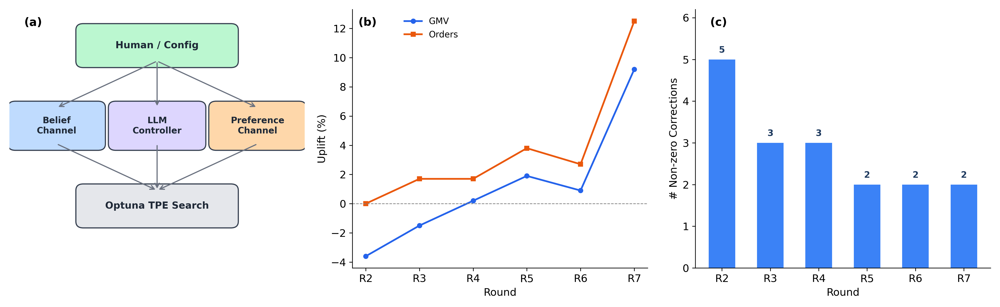
</p>

<p align="center">
  <em>(a) 三层架构 &nbsp;|&nbsp; (b) 各轮次线上指标变化 &nbsp;|&nbsp; (c) LLM 修正收敛趋势</em>
</p>

<br>

## Sortify vs. autoresearch

> [!NOTE]
> **由 `codex-gpt-5.4-xhigh` 自动生成的对照分析。** [`autoresearch`](https://github.com/karpathy/autoresearch) 与 Sortify 几乎同期完成，是一次天然的架构对比机会。

**关键结论：** `autoresearch` 是一个非常强的"最小可行 harness"样板：它把研究问题压缩成单文件可变、单指标裁决、固定时间预算的局部自治实验循环。Sortify 则是把 harness 本身做成了产品：它不仅约束 agent 怎么试，还把"世界模型如何修正、偏好如何修正、记忆如何积累、自治如何恢复、决策如何审计"全部工程化了。

- `autoresearch` 的重点是**让 agent 在一个足够干净的实验盒子里高频试错**
- Sortify 的重点是**让 agent 在一个不干净、会漂移、带约束、要上线、要审计的真实世界里持续做对事**

| 维度 | [`autoresearch`](https://github.com/karpathy/autoresearch) | Sortify | 判断 |
|---|---|---|---|
| 问题类型 | 本地单机、单指标、短反馈闭环的模型训练优化 | 线上推荐排序、多目标约束、offline-online gap 的持续优化 | Sortify 面对的是高熵世界，架构要求高一个量级 |
| Agent 作用位点 | 直接修改 `train.py` | 不碰底层参数，只校准搜索框架 | Sortify 更像"bounded advisor"；`autoresearch` 更像"hands-on hacker" |
| 可变面 | 单文件 `train.py` | target range、penalty weight、搜索配置、上线参数发布 | `autoresearch` 是强约束最小面；Sortify 是分层可变面 |
| 评测器 | `prepare.py` 中固定 `evaluate_bpb`，5 分钟 wall-clock | offline Influence objective + online A/B + transfer calibration | Sortify 的 evaluator 不是单点评测，而是一个跨轮现实校准系统 |
| 搜索方式 | agent 通过自然语言策略做启发式局部搜索 | Optuna TPE 5000 trials / 25 workers 做数值搜索 | Sortify 把"想"和"搜"分开了 |
| 记忆 | Git + `results.tsv` + `run.log` + notebook | 7 表 Memory DB + proposal/evidence/update history + state files | Sortify 的记忆是系统一等公民，`autoresearch` 的记忆更像实验笔记 |
| 自治循环 | `program.md` 约束外部 agent 无限循环 | 系统内建 one-shot / YOLO pipeline | `autoresearch` 是 protocol-first；Sortify 是 runtime-first |
| 校准能力 | 几乎无显式校准，直接看测得 `val_bpb` | Belief / Preference 双通道校准 | 这是两者最本质的结构分水岭 |
| 安全与治理 | 固定 evaluator、只改一文件、不加依赖、超时 kill | clamp、fallback、freeze、audit、outer governance loop | Sortify 明显更接近生产级自治 |
| 可解释性 | 变更描述 + frontier 图 | episode 证据链 + proposal reason + evidence link + update history | Sortify 的诊断颗粒度高得多 |

<br>

## 核心结果

| 市场 | 指标 | 结果 |
|------|------|------|
| A 市场（热启动） | GMV | 7 轮内 **-3.6% &rarr; +9.2%** |
| A 市场（热启动） | 订单数 | 峰值 **+12.5%** |
| B 市场（冷启动） | GMV/UU | **+4.15%**（7 天 A/B 测试） |
| B 市场（冷启动） | 广告收入 | **+3.58%**（7 天 A/B 测试） |

- 全自动运行：**每天约 6 轮**，启动后零人工干预
- 单轮 LLM 成本：**约 $0.03 – $0.10**
- LLM 修正项从 **5 &rarr; 2 个**，系统逐轮稳定

<br>

## 问题背景

传统排序优化面临三个结构性困境：

<p align="center">
  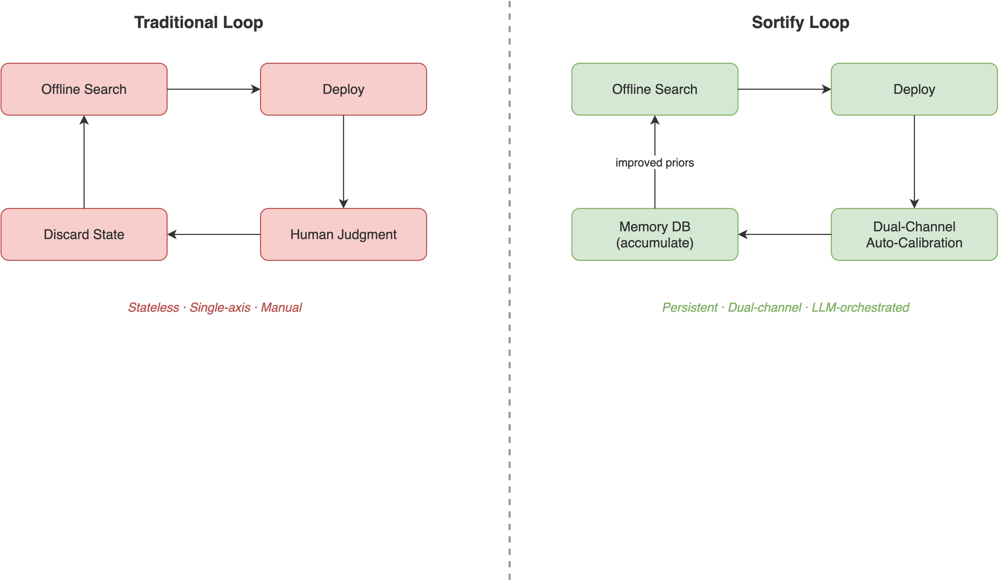
</p>

1. **离线-线上鸿沟** — 离线优化的参数在线上系统性地产生偏差。不同指标的偏差方向不对称（有的乐观、有的悲观），单一校准系数无法同时修正。

2. **诊断信号纠缠** — 当某指标表现不佳时，到底是世界模型错了（离线预测失准），还是价值函数错了（对违约惩罚不够）？两者需要截然相反的修正方向，但呈现出完全相同的症状。

3. **跨轮次无记忆** — 每轮优化从零开始。历史丢弃，来之不易的校准经验付之东流。

<br>

## 系统架构

Sortify 以 [Savage 的主观期望效用（SEU）理论](https://en.wikipedia.org/wiki/Subjective_expected_utility) 为理论基础，构建了一套**三层架构**。SEU 理论的核心公理要求将"对世界的信念"与"对结果的偏好"严格分离。

<p align="center">
  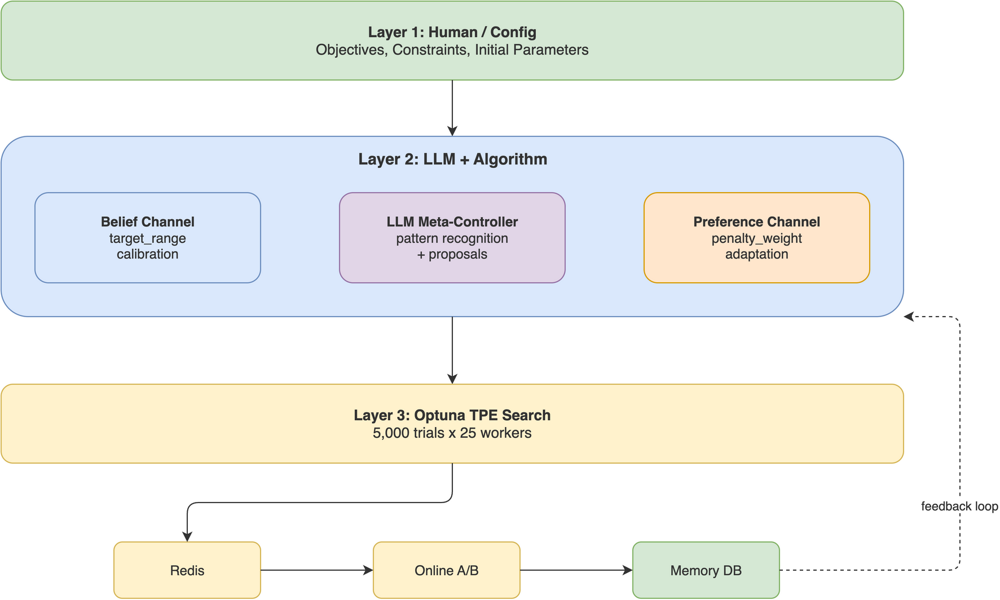
</p>

| 层级 | 职责 | 更新方式 |
|------|------|----------|
| **第一层：人工 / 配置** | 业务目标、约束条件、初始参数 | 人工设定（低频） |
| **第二层：LLM + 算法** | 信念校准、偏好适配 | 双通道自动校准 |
| **第三层：Optuna TPE 搜索** | 寻找最优 7 维参数向量 | 5,000 次试验 &times; 25 并行 |

### 影响力份额：可分解的排序指标

<p align="center">
  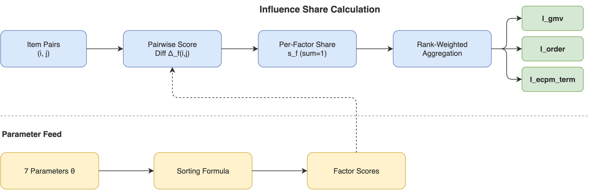
</p>

Sortify 提出了一种全新的指标——**影响力份额（Influence Share）**，将排序决策分解为各因子的百分比贡献。与 Kendall Tau 不同，影响力份额具有以下特性：

- **可分解**：每个因子的精确贡献可量化
- **可加性**：所有因子份额恒等于 100%
- **单调性**：增大某因子的参数权重必然增大其份额
- **可操作**：支持精确的权衡推理（"将 5% 的影响力从订单转移到 GMV"）

### 双通道：信念 &times; 偏好

<p align="center">
  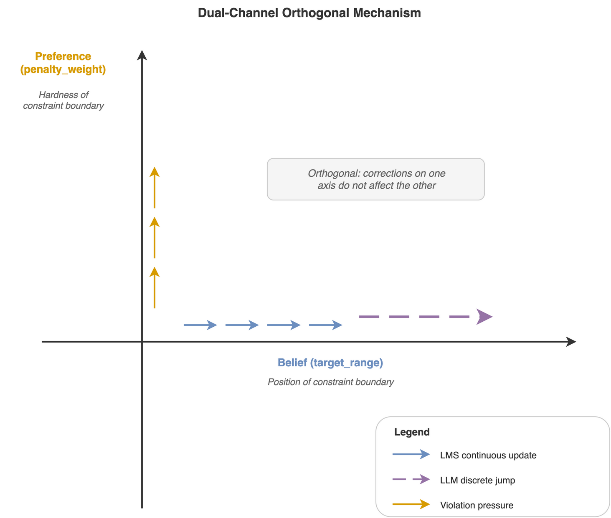
</p>

第二层的核心是一个**正交双通道机制**，分别修正两类本质不同的误差：

| | 信念通道（求真） | 偏好通道（求善） |
|-|----------------|-----------------|
| **核心问题** | "离线指标如何映射到线上现实？" | "约束违反应受多大惩罚？" |
| **控制对象** | `target_range`（约束边界位置） | `penalty_weight`（约束边界硬度） |
| **更新规则** | LMS 回归（平滑）+ LLM 截距跳变（选择性） | 非对称乘性缩放 |
| **误差类型** | 认知性 — 世界模型失准 | 价值性 — 偏好校准失准 |
| **类比** | 修正地图以匹配地形 | 调整你对绕路的容忍度 |

两个通道在几何上正交：信念通道水平移动约束边界，偏好通道垂直缩放违约代价。一个轴上的修正不干扰另一个轴。

### LLM 元控制器

<p align="center">
  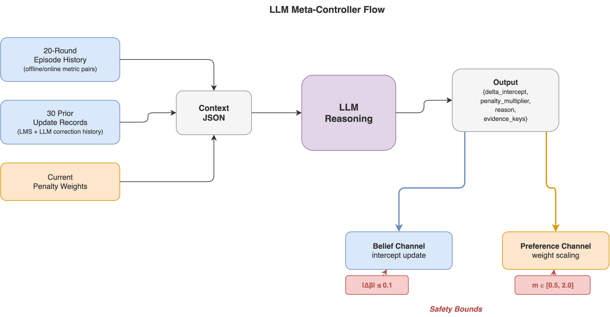
</p>

LLM 作为**框架层面的元控制器**运行——它从不直接调节底层参数。它只调整两个高层旋钮：

- **`delta_intercept`** ∈ [-0.1, +0.1] — 微调离线到线上的映射关系（信念通道）
- **`penalty_multiplier`** ∈ [0.5, 2.0] — 缩放约束严格程度（偏好通道）

它接收最近 20 轮的结构化上下文和 30 条校准更新记录，识别模式并返回带有强制证据引用的 JSON 提案。当置信度不足时，返回空提案——安全性内建于设计之中。

### 持久化记忆

一个 7 表 SQLite 数据库跨轮次积累经验：

| 表 | 用途 |
|----|------|
| `episodes` | 完整的离线/线上配对记录 |
| `prior_relations` | 当前迁移斜率与截距（6 个指标关系） |
| `prior_update_history` | 所有信念更新记录（LMS + LLM），30 条窗口 |
| `penalty_weights` | 当前约束惩罚值 |
| `penalty_weight_update_history` | 偏好通道更新记录，30 条窗口 |
| `llm_proposals` | LLM 建议及证据引用 |
| `evidence_links` | 提案与轮次之间的可追溯链接 |

这消除了"土拨鼠之日"问题——每一轮都继承并构建于此前所有学习之上。

<br>

## 持续运行：YOLO 循环

<p align="center">
  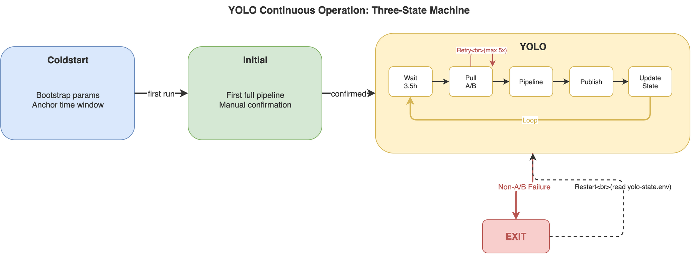
</p>

Sortify 以三态状态机运行：

1. **Coldstart** — 引导初始参数，锚定时间窗口
2. **Initial** — 执行完整流水线一次，可选人工确认
3. **YOLO** — 无限自主循环：等待 3.5 小时数据积累 &rarr; 拉取 A/B 报告 &rarr; 执行 10 步流水线 &rarr; 发布参数 &rarr; 重复

每个 YOLO 周期执行 **10 步流水线**：

<p align="center">
  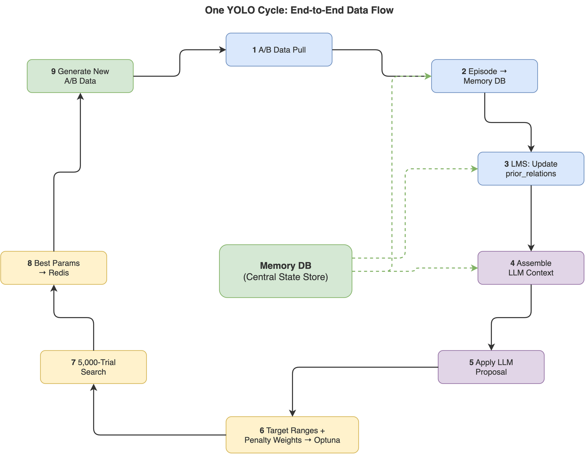
</p>

> 拉取 A/B 数据 &rarr; 写入记忆库 &rarr; LMS 校准 &rarr; 组装 LLM 上下文 &rarr; LLM 提案 &rarr; 应用更新 &rarr; 推导目标区间 &rarr; 更新惩罚 &rarr; Optuna 搜索 &rarr; 发布至 Redis

<br>

## 评测

### A 市场：热启动（7 轮，25 小时）

<p align="center">
  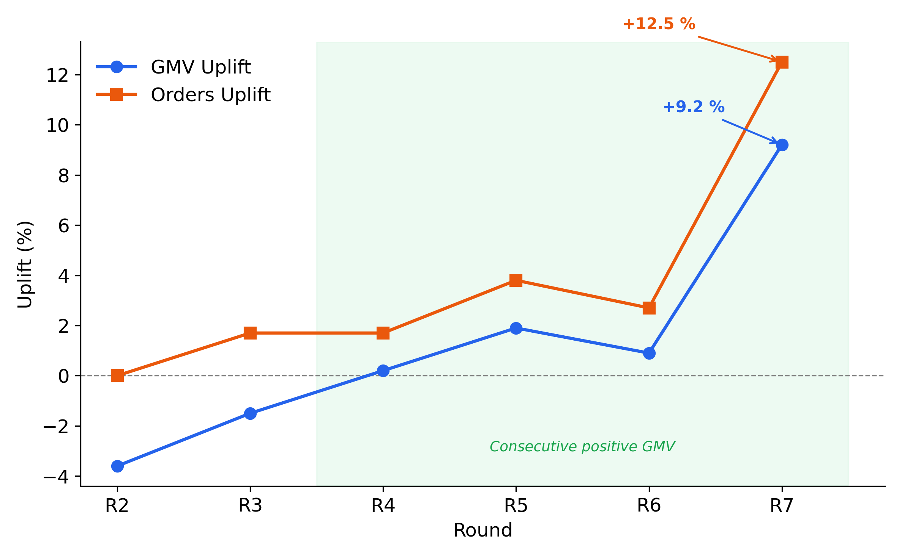
</p>

GMV 在 7 轮内从 **-3.6%** 恢复至 **+9.2%**，连续 4 轮正增长。订单峰值达 **+12.5%**。系统展现了真正的自我修正能力——并非随机游走，而是由校准后的信念更新驱动的定向改善。

### 离线-线上校准

<p align="center">
  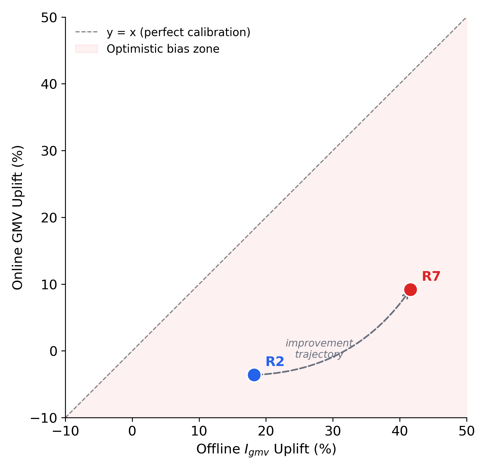
</p>

从 R2 到 R7 的轨迹显示系统逐步学会将离线预测转化为线上结果。R2 时离线 I_gmv +18.2% 对应线上 GMV -3.6%（严重乐观偏差）。到 R7，校准后的模型正确预测了离线 +41.6% 将带来线上 +9.2%。

### 参数演化

<p align="center">
  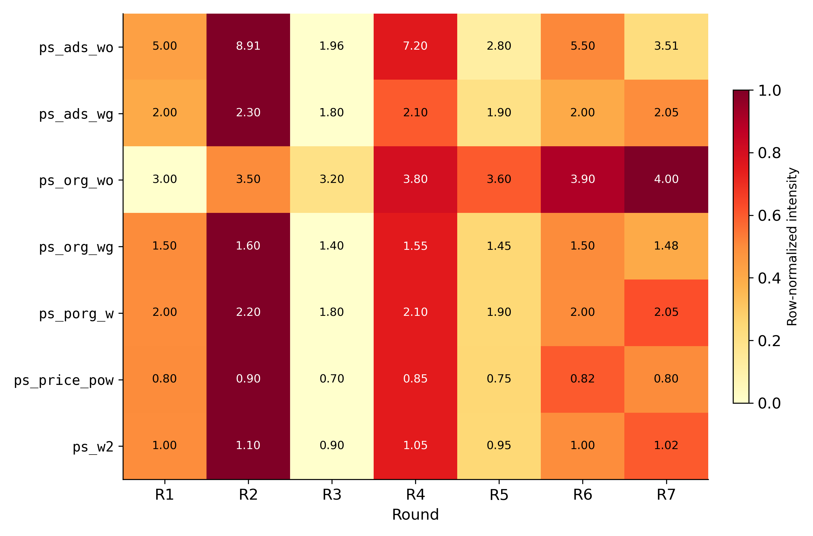
</p>

热力图展示了 7 个参数在各轮次中的演化。大部分参数趋于稳定；`ps_ads_wo` 振荡幅度最大（4.5 倍），反映了广告可见度与自然相关性之间的结构性张力——单目标优化无法完全消解的根本权衡。

### LLM 收敛性

<p align="center">
  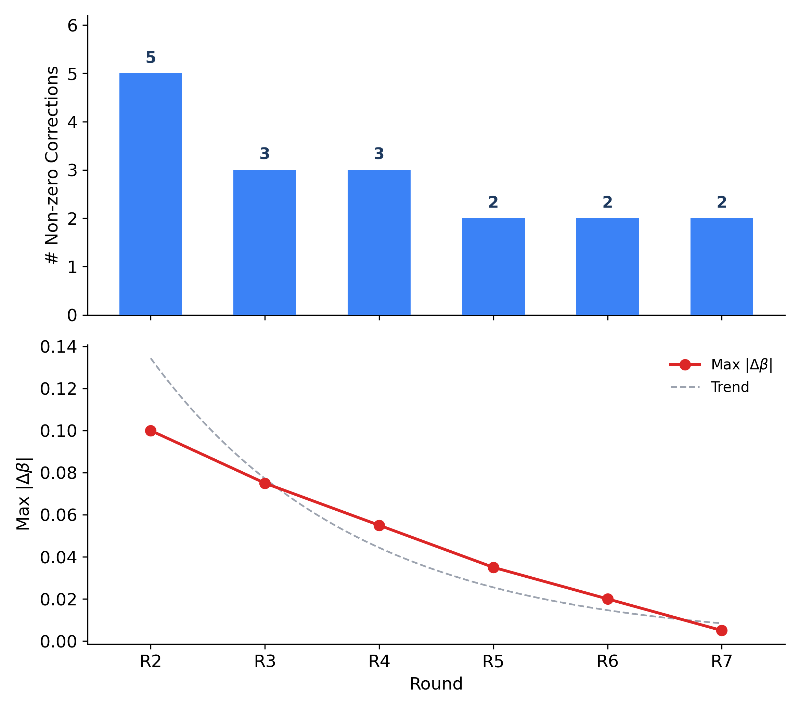
</p>

LLM 的非零修正项从 5 个（R2）降至 2 个（R7），最大修正幅度呈指数衰减。LLM 的角色从早期的激进框架重置，逐步转变为温和的残差修正——这是系统级学习的直接证据。

<br>

## 设计哲学

Sortify 的架构并非工程启发式的拼凑——而是 **Savage SEU 公理**的必然推论。核心设计立场：

- **信念-偏好分离是强制性的**，而非可选的。将"我认为会发生什么"与"我希望发生什么"混在一起，会产生"一厢情愿"（乐观信念膨胀）或"酸葡萄"（偏好扭曲以迎合错误预测）。双通道架构是这一公理的结构性强制执行。

- **LLM 控制框架，而非参数。** 底层参数最优值是数据依赖的一次性事实——每轮都会变化，最适合由数值搜索求解。框架参数（迁移模型、惩罚权重）编码的是跨轮次的结构性规律——恰恰是 LLM 擅长识别的知识类型。

- **非对称损失厌恶内嵌于设计中。** 约束违反时的收紧速度是满足时的放松速度的 3 倍（δ_up = 0.25 vs δ_down = 0.08）。这反映了现实世界的不对称性：指标不达标对业务信任的损害，远大于在约束上略有冗余的代价。

- **记忆不是优化历史——而是积累的判断力。** 7 表记忆库存储的不仅是历史参数，而是校准后的世界模型、经过验证的权衡方案和有证据链接的决策。每一轮的起点都比上一轮更聪明。

<br>

## 项目规模

| 维度 | 数值 |
|------|------|
| 系统代码量 | 98,000 行，78 个模块，7 个子系统 |
| 实验轮次 | 跨 2 个市场 30+ 轮 |
| 最长连续运行 | 25 小时（7 轮，全程自主） |
| 单轮周期 | ~4 小时（3.5 小时数据积累 + 25–50 分钟处理） |
| LLM 成本 | ~$0.03–$0.10/轮 |
| 人工代码 | **0 行** — 全部由 AI 智能体生成 |
| 基础框架 | [ParaDance](https://pypi.org/project/paradance/) — 20 个月前驱项目，PyPI 下载量 101K+ |

<br>

## 架构解析

[架构解析](docs/dives/) 系列是技术报告的配套阅读材料，用来重组和解释论文已经公开的核心思想。八篇自包含文章，从理论基础到哲学反思：

| # | 文档 | 核心问题 |
|---|------|----------|
| 1 | [理论基础](docs/dives/zh/01-theoretical-foundations.md) | 为什么信念和偏好必须分离？ |
| 2 | [影响力份额](docs/dives/zh/02-influence-share.md) | 如何量化每个因子对排序的贡献？ |
| 3 | [双通道机制](docs/dives/zh/03-dual-channel-mechanism.md) | 信念通道和偏好通道具体如何运作？ |
| 4 | [LLM 元控制器](docs/dives/zh/04-llm-meta-controller.md) | LLM 做什么，以及它刻意不做什么？ |
| 5 | [搜索引擎](docs/dives/zh/05-search-engine.md) | Optuna 如何在约束下找到最优参数？ |
| 6 | [流水线与运维](docs/dives/zh/06-pipeline-and-operations.md) | 单轮如何运行，多轮如何链接为持续运行？ |
| 7 | [记忆架构](docs/dives/zh/07-memory-architecture.md) | 为什么持久化记忆是其他一切的前提？ |
| 8 | [元反思](docs/dives/zh/08-meta-reflection.md) | AI 智能体构建 AI 智能体意味着什么？ |

建议从 #1 和 #2 开始了解基础，然后阅读 #3 和 #4 理解核心循环。

<br>

## 资源导航

<table>
<tr>
<td align="center" width="33%">
<h3><a href="https://arxiv.org/abs/2603.27765">Technical Report</a></h3>
<sub>完整系统架构、评测与讨论</sub>
</td>
<td align="center" width="33%">
<a href="docs/dives/zh/"><strong>架构解析 (中文)</strong></a><br>
<sub>8 篇配套导读，帮助理解论文主线</sub>
</td>
<td align="center" width="33%">
<a href="docs/sortify-demo.mp4"><strong>演示视频</strong></a><br>
<sub>与技术报告配套的可视化讲解</sub>
</td>
</tr>
</table>

<br>

## 仓库结构

```
sortify-tech-report/
├── README.md                              # English documentation
├── README-zh.md                           # 中文文档（本文件）
├── docs/
│   ├── sortify-demo.mp4                   # 演示视频
│   └── dives/                            # 架构解析（双语）
│       ├── en/                            # English (8 docs + index)
│       └── zh/                            # 中文 (8 篇 + 索引)
└── figures/                               # 架构图与评测图表
```

## 引用

如果 Sortify 对你的研究或工作有帮助，请引用：

```bibtex
@misc{cheng2026lettheagent,
  title   = {Let the Agent Steer: Closed-Loop Ranking Optimization via Influence Exchange},
  author  = {Yin Cheng and Liao Zhou and Xiyu Liang and Dihao Luo and Tewei Lee and Kailun Zheng and Weiwei Zhang and Mingchen Cai and Jian Dong and Andy Zhang},
  year    = {2026},
  eprint  = {2603.27765},
  archivePrefix = {arXiv},
  primaryClass  = {cs.AI}
}
```

## 许可

本仓库包含 Sortify 技术报告的文档、图表与配套阅读材料。保留所有权利。
